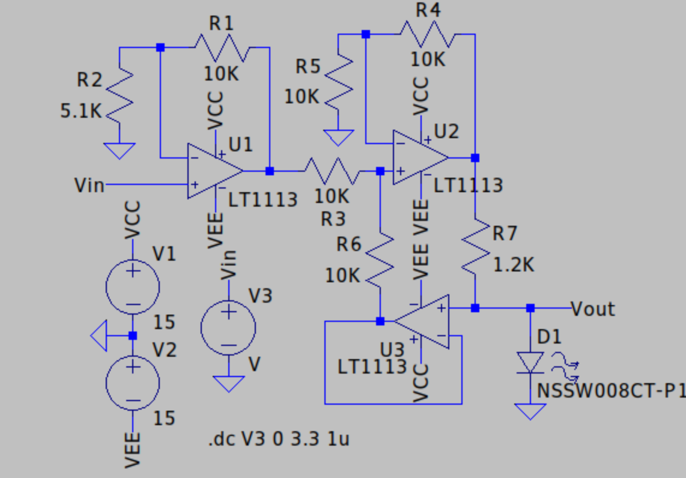

# What's this?
This repository stores Diode tester project's firmware source code.
# Usage
## Install Development Environment
In order to compile this project, you need:
1. make
2. arm-none-eabi-gcc

You can install it on Ubuntu by running
```
sudo apt-get update
sudo apt-get install make arm-none-eabi-gcc
```
## Compile
Compiling this project is very simple.You only need to run this:
```
make -j
```
# Hardware
This particular project needs to build a specific circuit.Which is a V-I transformer.My solution just like this:  


# Known issues

1. V-I Converter has no output clamping, it may output a dangerous high voltage that will destroy internal adc of stm32